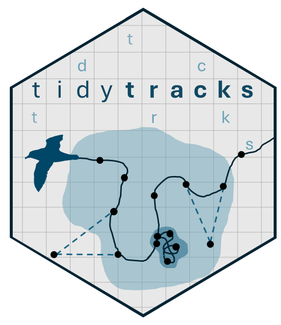

# tidytracks 

<!-- badges: start -->
[](https://app.codecov.io/gh/EvolEcolGroup/tidytracks)
[](https://github.com/EvolEcolGroup/tidytracks/actions/workflows/R-CMD-check.yaml)
<!-- badges: end -->

Movement ecology has been transformed by the availability of high-resolution tracking data, creating strong demand for tools that enable fast and reproducible data analysis.

'tidytracks' is an R package that provides tidyverse-friendly tools for processing, analysing, and visualising animal movement data. Built on the modern sf spatial infrastructure and leveraging the move2 object class, tidytracks organises data into efficient, relational tables that link spatiotemporal tracks with animal- and deployment-level metadata. Its consistent grammar of functions condenses complex workflows into a few lines of clear, intuitive code. 

'tidytracks' includes fast implementations of essential analysis steps - including speed filtering, trip splitting, summary statistics, and home range estimation - that previously required data class conversions across multiple packages. Integration with ggplot2 enables easy plotting of maps and figures.

By simplifying and standardizing common tasks in movement analysis, 'tidytracks' accelerates exploratory workflows and promotes reproducibility in movement ecology.

## Installation

You can install the development version of tidytracks from [GitHub](https://github.com/) with:

``` r
# install.packages("pak")
pak::pak("EvolEcolGroup/tidytracks")
```

## Example

This is a basic example which shows you how to solve a common problem:

``` r
library(tidytracks)
## basic example code
```

