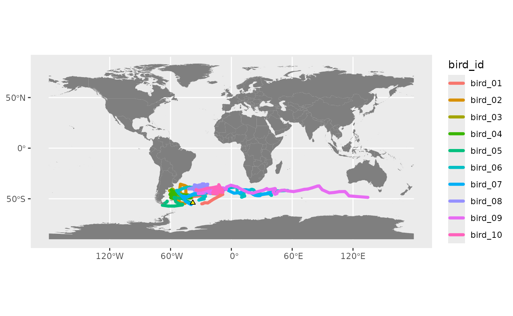
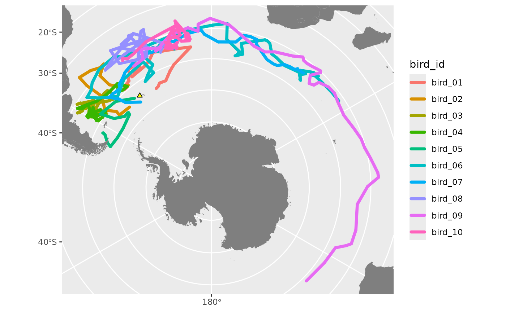
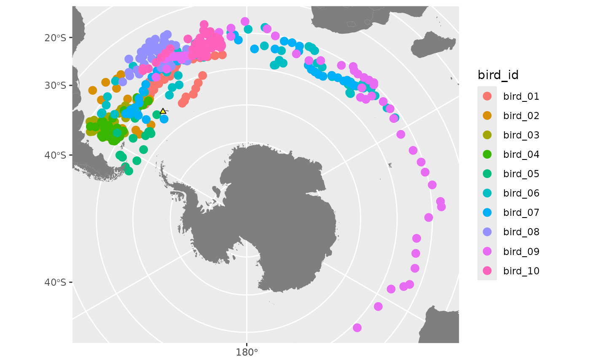
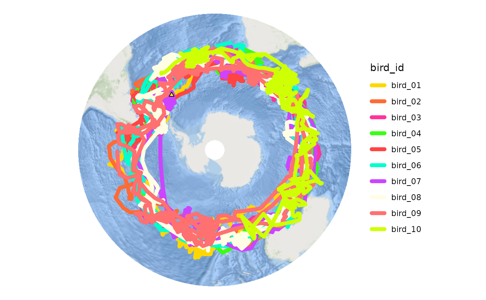

# Animations and maps

`tidytracks` also includes a function for animating maps of animal
movement data over time.

``` r

library(tidytracks)
library(ggplot2)
library(sf)
library(gganimate)
library(av)
```

------------------------------------------------------------------------

## load tracking data

First, load your data. Here we are using 10 wandering albatross tracks
from Bird Island, South Georgia, each lasting approximately 1 year.

``` r

# load data from CSV file into tidytracks
df <- tt_read_data(
  events = "data/wanderer_example_tracks.csv",
  col_track_id = "bird_id",
  col_coords = c("lon", "lat"),
  col_date_time = "date_time"
)

# inspect the data
df
## A <move2> with `track_id_column` "bird_id" and `time_column` "date_time"
## Containing 10 tracks lasting on average 355 days in a
## Simple feature collection with 4506 features and 2 fields
## Geometry type: POINT
## Dimension:     XY
## Bounding box:  xmin: -179.85 ymin: -63.37 xmax: 179.55 ymax: -30.5
## Geodetic CRS:  WGS 84
## First 10 features:
##              date_time bird_id              geometry
## 1  2007-12-16 02:32:00 bird_01  POINT (-39.06 -48.8)
## 2  2007-12-16 14:37:00 bird_01 POINT (-40.37 -49.38)
## 3  2007-12-17 02:43:00 bird_01 POINT (-41.93 -49.27)
## 4  2007-12-17 14:38:00 bird_01  POINT (-40.5 -48.63)
## 5  2007-12-18 02:35:00 bird_01 POINT (-39.56 -48.34)
## 6  2007-12-18 14:26:00 bird_01 POINT (-37.25 -47.96)
## 7  2007-12-19 02:26:00 bird_01  POINT (-37.19 -46.8)
## 8  2007-12-19 14:19:00 bird_01 POINT (-35.63 -46.39)
## 9  2007-12-20 02:15:00 bird_01 POINT (-34.32 -46.17)
## 10 2007-12-20 14:14:00 bird_01 POINT (-34.13 -46.66)
## To see track metadata, use `show_meta()`
```

### regularise data

Animation works best with regular time steps and, if you have multiple
individuals, matching timestamps across individuals that were tracked
concurrently. Therefore we regularise our timestamps if we haven’t
already:

``` r

df <- tt_regular_time(
  x = df,
  interval = as_units(12, "hour"),
  snap_times = TRUE
)
df
## A <move2> with `track_id_column` "bird_id" and `time_column` "date_time"
## Containing 10 tracks lasting on average 354 days in a
## Simple feature collection with 7093 features and 2 fields
## Geometry type: POINT
## Dimension:     XY
## Bounding box:  xmin: -179.8794 ymin: -63.10255 xmax: 179.76 ymax: -30.57208
## Geodetic CRS:  WGS 84
## First 10 features:
##              date_time bird_id                    geometry
## 1  2007-12-16 12:00:00 bird_01 POINT (-40.08372 -49.25566)
## 2  2007-12-17 00:00:00 bird_01 POINT (-41.58037 -49.29652)
## 3  2007-12-17 12:00:00 bird_01 POINT (-40.81285 -48.77294)
## 4  2007-12-18 00:00:00 bird_01  POINT (-39.7623 -48.40334)
## 5  2007-12-18 12:00:00 bird_01  POINT (-37.72153 -48.0418)
## 6  2007-12-19 00:00:00 bird_01 POINT (-37.20196 -47.03522)
## 7  2007-12-19 12:00:00 bird_01 POINT (-35.93227 -46.47159)
## 8  2007-12-20 00:00:00 bird_01 POINT (-34.56619 -46.21262)
## 9  2007-12-20 12:00:00 bird_01  POINT (-34.16567 -46.5687)
## 10 2007-12-21 00:00:00 bird_01 POINT (-33.05775 -46.98074)
## To see track metadata, use `show_meta()`
```

------------------------------------------------------------------------

## examples 1 & 2: map with polygons

NB. We use a subset (first 30 days) of the dataset for these maps to
keep the file size of the animations low.

### load layers

Read in any other layers you want to include in your map, e.g.

- raster file such as bathymetry to use as a basemap
- polygons e.g. countries, national park boundaries
- points e.g. colony or tagging location

``` r

# make colony dataframe, make it spatial and add CRS using sf package
colony <- data.frame(colony = "Bird Island", lon = -38.03, lat = -54) %>%
  st_as_sf(coords = c("lon", "lat")) %>%
  st_set_crs(4326)

# read countries from rnaturalearth at medium res
library(rnaturalearth)
land <- ne_countries(scale = "medium", returnclass = "sf")
```

### subset data to test

We’re going to test out our maps and animations on the first 30 days of
the data.

``` r

# subset the tracking data to the first 30 days, to test our animation
df_sub <- df %>%
  dplyr::filter(date_time <= (min(df$date_time) + lubridate::days(30)))
```

### make map

Next, assemble your map using `ggplot2`. Add `sf` layers using
`geom_sf`, `terra` layers using `tidyterra`’s functions
`geom_spatraster` (for rasters) or `geom_spatvector` (for vectors), and
add your `tidytracks` layer using `geom_event_path` for paths or
`geom_event_point` for points.

``` r

# make the map
map <- ggplot() +
  geom_event_path(
    data = df_sub, aes(col = bird_id), # tracks layer
    size = 1.5, lineend = "round"
  ) + # rounded line ends look smoother
  geom_sf(data = land, fill = "grey50", col = NA) + # land polygons
  geom_sf(data = colony, pch = 24, fill = "yellow") # add colony layer
# print the map
map
```



### projection and limits

Use `ggplot2` functions `coord_cartesian` or `coord_sf` to change the
limits of the plot (alternatively, you can crop all your layers to the
required area before making the plot). `coord_sf` can also change the
projection.

``` r

# define south polar LAEA projection for plotting
my_crs <- paste0(
  "+proj=laea +lat_0=-90 +lon_0=0 +x_0=0 +y_0=0 ",
  "+datum=WGS84 +units=m +no_defs"
)

# you can use st_coordinates to get min/max coordinates of your tracking data
range(st_coordinates(df)[, "X"])
## [1] -179.8794  179.7600
range(st_coordinates(df)[, "Y"])
## [1] -63.10255 -30.57208

# update extent of map using extent of tracking data
map <- map +
  coord_sf(
    crs = my_crs, # change projection to LAEA South Polar
    # NB. lims must be in the units of the target CRS, so we need to
    # transform the data to that crs using st_transform
    xlim = range(st_coordinates(st_transform(df_sub, my_crs))[, "X"]),
    ylim = range(st_coordinates(st_transform(df_sub, my_crs))[, "Y"])
  )
map
```



### animate map

Animate the map using
[`animate_map()`](https://evolecolgroup.github.io/tidytracks/reference/animate_map.md).
This produces a `gganim` object (a `ggplot2` object with extra animation
logic). We will use the `animate` function from the `gganimate` package
to render the animation from this object.

Our `gganim` object has an attribute called `n_timesteps`. This is the
number of unique timestamps in the tracking data used to make the plot.
To ensure a smooth animation, we need to render it with **at least as
many frames as there are time steps** in the tracking data.

``` r

map_anim <- animate_map(
  p = map, # our ggplot map
  wake_length = 0.3, # proportion of total animation time
  label_format = "%B %d" # month and date
)

class(map_anim) # the gganim object
## [1] "gganim"          "ggplot2::ggplot" "ggplot"          "ggplot2::gg"    
## [5] "S7_object"       "gg"
attr(map_anim, "n_timesteps") # number of time steps in animation
## [1] 60
```

### render animation

Now, we render the animation using
[`gganimate::animate()`](https://gganimate.com/reference/animate.html).
By default, `gganimate` uses 100 frames. We will change this using the
`nframes` parameter.

You can **specify the length of your animation** using two out of these
three parameters:

- `nframes`: number of frames to render (default 100)
- `fps`: framerate in frames/second (default 10)
- `duration`: duration of the animation in seconds (no default)

Here we use the suggested number of frames, and a duration of 20
seconds. Depending on the number of frames, rendering take a few minutes
or longer.

See the [gganimate
documentation](https://gganimate.com/reference/animate.html) for more
information on the different renderer options for making your animation.
You can also save each frame as an image file and use your own software
to bind them into a video.

``` r

gganimate::animate(
  plot = map_anim, # our ggplot with added animation
  # Number of frames equals time steps in the data.
  nframes = attr(map_anim, "n_timesteps"),
  duration = 5, # video duration in seconds
  renderer = av_renderer(), # default is gifski_renderer()
  # optionally, specify width and height of output animation
  width = 540, height = 400,
  units = "px", res = 96 # w/h in pixels, res in dpi
)
```

To save the animation to file, use `gganimate`’s
[`anim_save()`](https://gganimate.com/reference/anim_save.html) function
which by default saves the most recent animation, similarly to
[`ggsave()`](https://ggplot2.tidyverse.org/reference/ggsave.html).

``` r

anim_save("example_animation.webm") # add appropriate file extension
```

### points vs paths

This animation included the tracking data as paths using
[`geom_event_path()`](https://evolecolgroup.github.io/tidytracks/reference/geom_event_path.md).
Let’s illustrate the difference between paths and points by re-creating
it using
[`geom_event_point()`](https://evolecolgroup.github.io/tidytracks/reference/geom_event_point.md).

``` r

# first, make the map and print it to check
map <- ggplot() +
  geom_event_point(data = df_sub, aes(col = bird_id), size = 3) + # tracks layer
  geom_sf(data = land, fill = "grey50", col = NA) + # land polygons
  geom_sf(data = colony, pch = 24, fill = "yellow") + # add colony layer
  coord_sf(
    crs = my_crs, # change projection and define limits
    xlim = range(st_coordinates(st_transform(df_sub, my_crs))[, "X"]),
    ylim = range(st_coordinates(st_transform(df_sub, my_crs))[, "Y"])
  )
# print to check
map
```



``` r

# add animation
map_anim2 <- animate_map(
  p = map,
  wake_length = 0.3,
  label_format = "%B %d"
)
```

``` r

# render the animation
gganimate::animate(
  plot = map_anim2,
  nframes = attr(map_anim2, "n_timesteps"),
  duration = 5,
  renderer = av_renderer(),
  # optionally, specify width and height of output animation
  width = 540, height = 400,
  units = "px", res = 96
)
```

Points animations work best when the resolution of the tracking data is
high, so points are closer together.

------------------------------------------------------------------------

## example 3: map with raster

In this example we’re going to add a basemap as a `spatRaster` object
using the package `terra`. We’ll download a raster using the `basemaps`
package, but you can also load in your own raster (for example, from a
`geotiff` or `netCDF` file) using
[`terra::rast()`](https://rspatial.github.io/terra/reference/rast.html)
and add it to the map using
[`tidyterra::geom_spatraster`](https://dieghernan.github.io/tidyterra/reference/geom_spatraster.html).

``` r

# load packages for acquiring, loading, and plotting rasters
library(basemaps)
library(terra)
library(tidyterra)
```

### get basemap

To download using `basemaps`, you need to ask for a defined spatial
extent (in longitude/latitude) - usually we want the bounding box of our
data so we can define the extent programmatically, but sometimes you may
want to define it manually, or add a buffer around your data.

``` r

# option 1: make a rectangle as the bounding box of all the data (in lon/lat)
rect <- st_as_sfc(st_bbox(df))

# option 2: specify the rectangle manually. I want the whole Southern Ocean
# and up to the northern extent of my data (plus a 15 degree buffer)
rect_coords <- c(
  xmin = -180, # define the corners
  xmax = 180,
  ymin = -90,
  ymax = max(st_coordinates(df)[, "Y"]) + 15
) # add buffer
# convert to an sfc object and set the CRS
rect <- st_as_sfc(st_bbox(rect_coords)) %>%
  st_set_crs(4326)
rect
## Geometry set for 1 feature 
## Geometry type: POLYGON
## Dimension:     XY
## Bounding box:  xmin: -180 ymin: -90 xmax: 180 ymax: -15.57208
## Geodetic CRS:  WGS 84
## POLYGON ((-180 -90, 180 -90, 180 -15.57208, -18...
```

Now we have the extent `rect`, let’s download the basemap.

``` r

# download basemap as a terra spatRaster
bmap <- basemap_terra(rect, map_service = "esri", map_type = "world_ocean_base")
## Loading basemap 'world_ocean_base' from map service 'esri'...
```

### make map

Now assemble our map. We can add the raster layer using the `tidyterra`
functions `geom_spatraster` (for single layer e.g. bathymetry raster) or
`geom_spatraster_rgb` (for RGB rasters with a layer for each of red,
green, blue).

``` r

# define new track colours to show up better on a blue background
track_colours <- c(
  "#FFD700", # Gold
  "#FF6B35", # Orange
  "#FF3399", # Hot pink
  "#39FF14", # Neon green
  "#FF4444", # Red
  "#00FFCC", # Aqua
  "#CC44FF", # Purple
  "#FFFEE4", # White ish
  "#FF7070", # Coral
  "#CFFF04" # Neon yellow
)

# assemble map
map <- ggplot() +
  geom_spatraster_rgb(data = bmap) + # basemap
  geom_event_path(
    data = df, aes(col = bird_id), size = 2, # tracks
    lineend = "round"
  ) +
  scale_colour_manual(values = track_colours) + # track colours
  geom_sf(data = colony, pch = 24, fill = "yellow") + # colony
  coord_sf(crs = my_crs) # projection

# remove axes and gridlines so it looks neater
map <- map +
  theme_void() +
  theme(
    plot.background = element_rect(
      fill = "white",
      colour = "white"
    )
  )
map
```



### animate

Now add the animation logic to the map and render the animation with the
suggested number of frames.

This time we’ll add the animation by piping the `ggplot` to
`animate_map` - both ways of using the function work.

``` r

# add animation to the map, this time with pipe
map_anim <- map %>%
  animate_map(
    wake_length = 0.1,
    label_format = "%B %Y"
  )

# render the animation
gganimate::animate(
  plot = map_anim,
  nframes = attr(map_anim, "n_timesteps"),
  duration = 20,
  renderer = av_renderer(),
  # optionally, specify width and height of output animation
  width = 568, height = 500,
  units = "px", res = 96
)
```

------------------------------------------------------------------------
