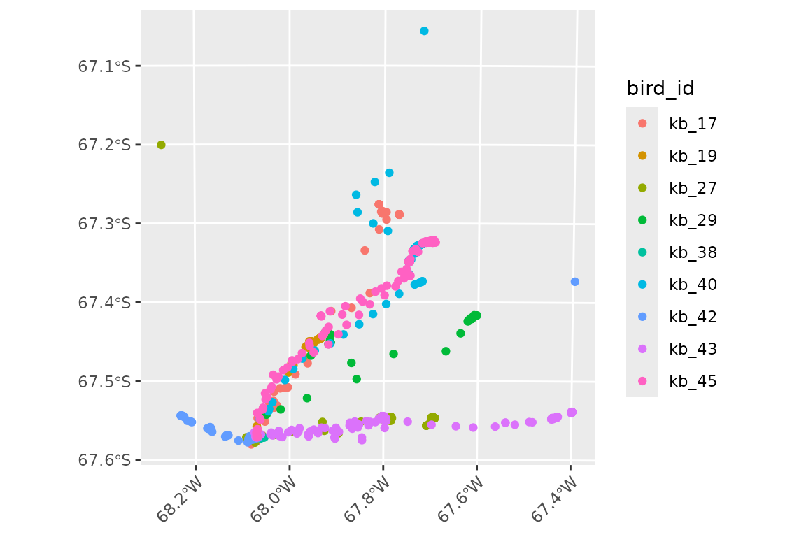
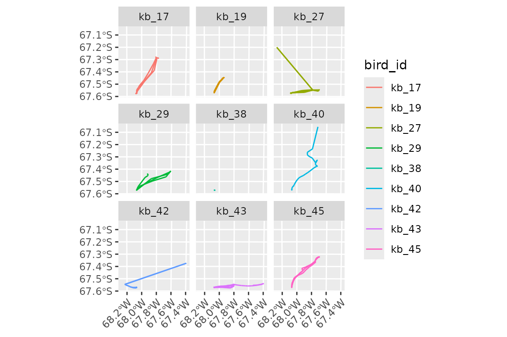
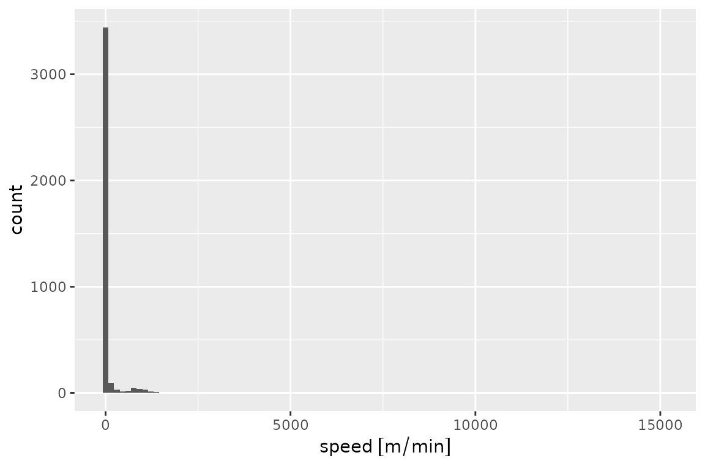
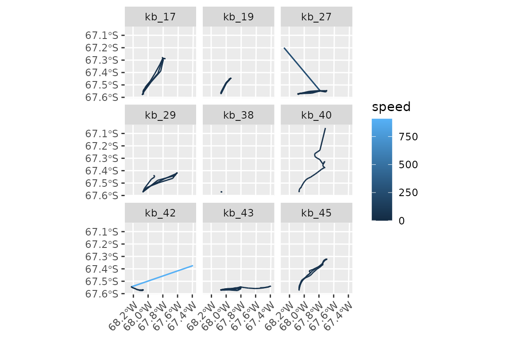
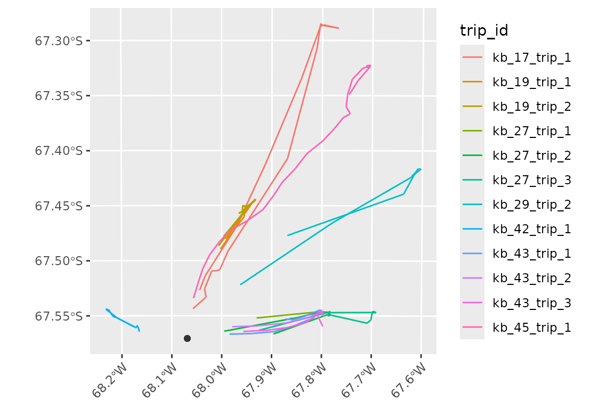
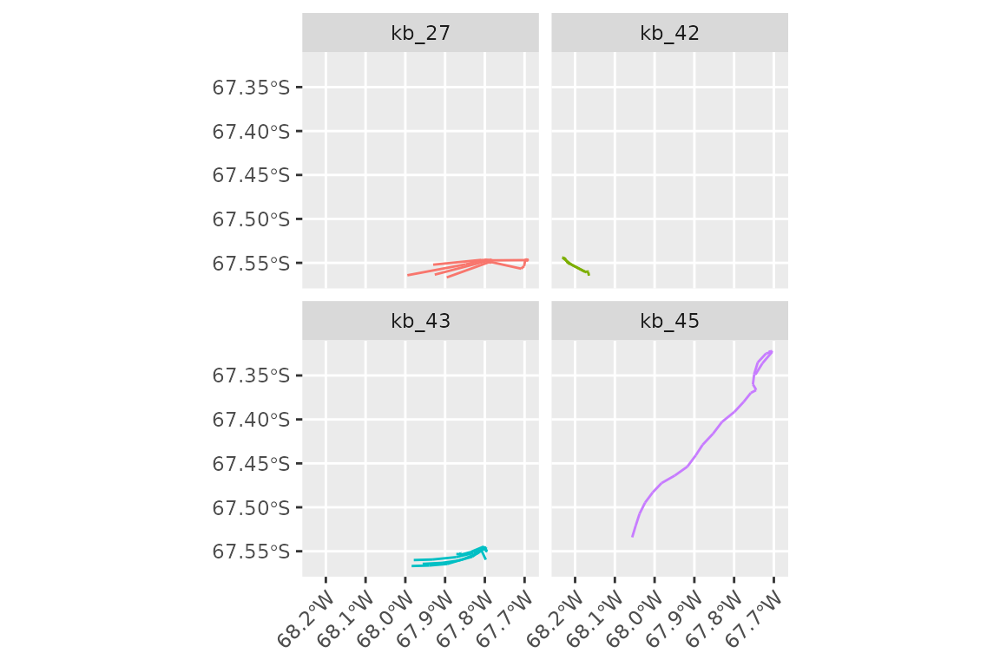
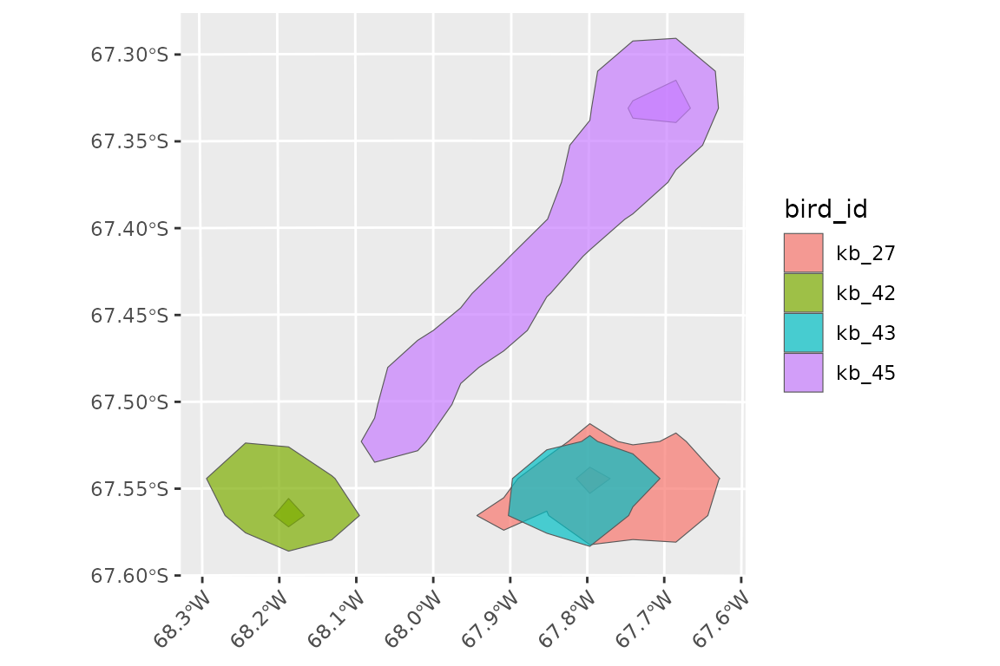
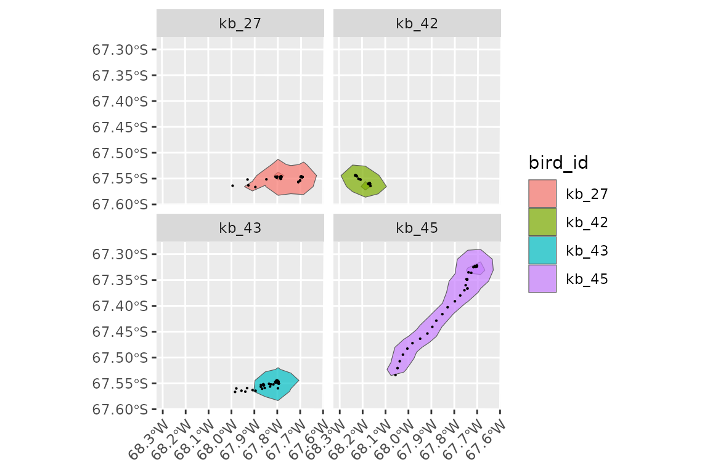
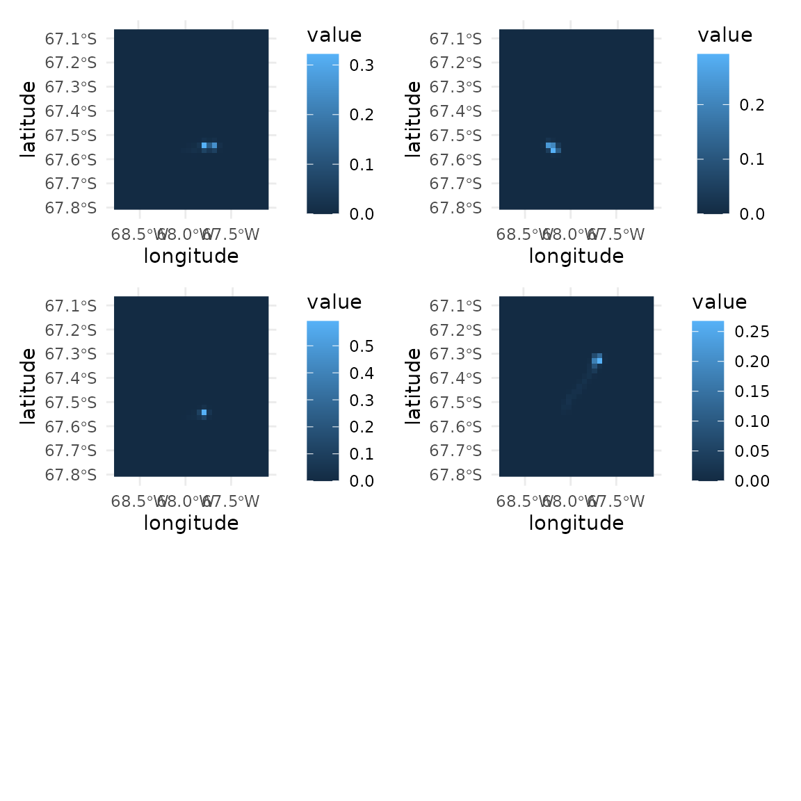
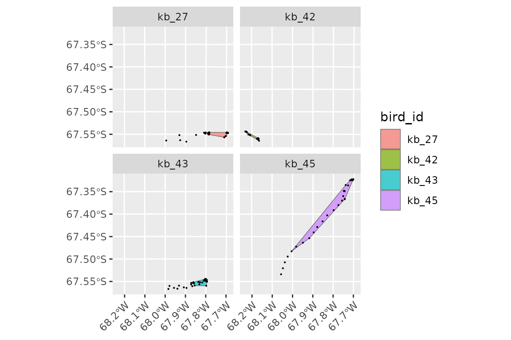

# tidytracks

## Tracking data representation in `tidytracks`

`tidytracks` uses tidy tables to represent movement, We refer to such a
table as a **tibble of tracks** (technically, such tables are `move2`
objects from the [move2](https://bartk.gitlab.io/move2/) package).

In a tibble of **tracks**, each row represents an **event**, which is a
time-stamped observation, associated with a location (and, optionally,
extra data such as activity information).

**Events** are grouped into **tracks**. Initially a **track** might be
all the locations from one deployment of a tracking device on an animal.
However, for central place foragers, we might want to split this track
into separate trips away from the central place. In this case, the unit
of tracking (i.e. the new **track**) will become the trip, rather than
the full deployment.

The **metadata** that describes each of these tracks is stored in a
separate table, which is linked to the event table by a
`track_id_column`. This means we do not have to repeat information (such
as the **ring_number** or **sex** of the animal, or the tracking
deployment information) for each **event**. Instead, we store this
track-level information in the **metadata** of the **track**.

## Reading data into a tibble of tracks

In `tidytracks`, we start by reading a table of events (e.g., GPS
locations) from a CSV file or as existing `data.frame` in R.

This table should contain at least the following columns: - one column
which is the `track_id` (i.e. the variable that groups events into a
track, e.g. `bird_id`, `logger_id`, or `deployment_id`) - two columns
representing the `x` and `y` coordinates (e.g. `longitude` and
`latitude`) - a `date-time` column (or separate `date` and `time`
columns)

Additional columns of data will be stored in the **events** table if
they have information that is specific to each event (i.e. the values
are not the same within a given track, e.g. the temperature recorded at
each location), or they will be moved to the **metadata** table if they
are track specific (e.g. sex of the individual, colony coordinates,
breeding status, etc.).

### Example data

This vignette will use an example dataset of GPS tracks from the
Antarctic shag *Leucocarbo bransfieldensis*, a seabird acting as a
central-place forager. This dataset contains 9 tracks with nearly 4,000
locations. Note that these are based on real data, but have been
modified to show the functionality of `tidytracks`. Please do not use
them for any real analyses of shag movement!

We have a single CSV. Each row includes information about the locations
(in this case `lon` and `lat`) and time (in this case, one `date_time`
column). Locations belonging to the same bird’s track are identified by
the same value in the `bird_id` column (in this example, as we only have
one track per bird, the unit of tracking is `bird_id`).

The CSV also contains other columns of information about the tracks
(`sex` and colony coordinates split into `colony_lat` and `colony_lon`).
These are repeated for each event, so they will be moved to the metadata
table when we create the `tidytracks` object.

``` r

library(tidytracks)
library(dplyr)
library(ggplot2)
library(sf)

shags_csv <- system.file(
  "extdata",
  "shags_example.csv",
  package = "tidytracks"
)

shags_tt <- tt_read_data(
  events = shags_csv,
  col_track_id = "bird_id",
  col_coords = c("lon", "lat"),
  col_date_time = "date_time",
  time_zone = "UTC",
  crs = 4326
)
```

Inspecting the events table, we have:

``` r

shags_tt
#> A <move2> with `track_id_column` "bird_id" and `time_column` "date_time"
#> Containing 9 tracks lasting on average 109052 secs in a
#> Simple feature collection with 3762 features and 3 fields
#> Geometry type: POINT
#> Dimension:     XY
#> Bounding box:  xmin: -68.26967 ymin: -67.58061 xmax: -67.39642 ymax: -67.0557
#> Geodetic CRS:  WGS 84
#> First 10 features:
#>    bird_id           date_time      speed                    geometry
#> 1    kb_17 2022-01-04 00:09:13 0.06112442 POINT (-68.06908 -67.57072)
#> 2    kb_17 2022-01-04 00:19:07 0.09105526 POINT (-68.06889 -67.57077)
#> 3    kb_17 2022-01-04 00:29:06 0.06175330 POINT (-68.06904 -67.57065)
#> 4    kb_17 2022-01-04 00:39:05 0.04324262 POINT (-68.06894 -67.57073)
#> 5    kb_17 2022-01-04 00:49:04 0.03435565 POINT (-68.06892 -67.57067)
#> 6    kb_17 2022-01-04 00:59:03 0.04847599 POINT (-68.06903 -67.57064)
#> 7    kb_17 2022-01-04 01:09:02 0.04014556 POINT (-68.06888 -67.57059)
#> 8    kb_17 2022-01-04 01:19:01 0.02357237 POINT (-68.06892 -67.57065)
#> 9    kb_17 2022-01-04 01:29:01 0.04011861 POINT (-68.06884 -67.57064)
#> 10   kb_17 2022-01-04 01:39:00 0.02165668 POINT (-68.06892 -67.57069)
#> To see track metadata, use `show_meta()`
```

We can see how each row in the table is an event, in this case a
time-stamped GPS location for a given bird, with the column `date_time`
providing the time and column `geometry` defining the location.
`bird_id` (the designated `track_id_column`) is the identifier that
groups a set of events into a single track.

The rest of the information was moved to the meta data table. We can
inspect the meta data table as follows:

``` r

show_meta(shags_tt)
#>   bird_id colony_lon colony_lat    sex
#> 1   kb_17  -68.06893  -67.57072   male
#> 2   kb_19  -68.06893  -67.57072   male
#> 3   kb_27  -68.06893  -67.57072 female
#> 4   kb_29  -68.06893  -67.57072   male
#> 5   kb_38  -68.06893  -67.57072   male
#> 6   kb_40  -68.06893  -67.57072   male
#> 7   kb_42  -68.06893  -67.57072 female
#> 8   kb_43  -68.06893  -67.57072 female
#> 9   kb_45  -68.06893  -67.57072 female
```

We have a `bird_id` column that links back to the events table, and then
information about the sex of each bird, as well two columns giving lon
and lat coordinates for the colony location.

Note that `move2` objects don’t have to be ordered by time, but for many
analyses, this is a requirement. We can order the data by time (within
each track) using the
[`tt_order_time()`](https://evolecolgroup.github.io/tidytracks/reference/tt_order_time.md)
function:

``` r

shags_tt <- shags_tt %>% tt_order_time()
```

Functions that start with `tt_` are specific to tidy tables of tracks
(i.e. `move2` objects), and they operate on the whole object.

## Plotting the data

To visualise the data with the `ggplot2` package, we can use the
[`geom_event_point()`](https://evolecolgroup.github.io/tidytracks/reference/geom_event_point.md)
function to plot the locations of each event. It is good practice to
project data each time we plot it.
[`geom_event_point()`](https://evolecolgroup.github.io/tidytracks/reference/geom_event_point.md)
is compatible with
[`coord_sf()`](https://ggplot2.tidyverse.org/reference/ggsf.html) so we
can add a projection directly into the `ggplot`. All other decorations
of `ggplot2` can be used; in this case, we will also adjust the aspect
ratio within
[`theme()`](https://ggplot2.tidyverse.org/reference/theme.html).

(This projection string is for an Azimuthal Equidistant projection
centred on the colony location, which is appropriate for this small
area.)

``` r

ggplot() +
  geom_event_point(data = shags_tt, aes(color = bird_id)) +
  coord_sf(crs = paste0(
    "+proj=aeqd +lon_0=-68 +lat_0=-67 ",
    "+units=m +datum=WGS84 +no_defs"
  )) +
  theme(
    aspect.ratio = 1,
    axis.text.x = element_text(angle = 45, hjust = 1)
  )
```



We can explore what each individual is doing by plotting the locations
of each individual separately with `facet_wrap`. In this example,
instead of plotting locations as points, we will use
[`geom_event_path()`](https://evolecolgroup.github.io/tidytracks/reference/geom_event_path.md)
to plot the paths between them:

``` r

ggplot() +
  geom_event_path(data = shags_tt, aes(color = bird_id)) +
  facet_wrap(~bird_id) +
  coord_sf(crs = paste0(
    "+proj=aeqd +lon_0=-68 +lat_0=-67 ",
    "+units=m +datum=WGS84 +no_defs"
  )) +
  theme(
    aspect.ratio = 1,
    axis.text.x = element_text(angle = 45, hjust = 1)
  )
```



We can see that bird `'kb_38'` moved very little (or not at all) during
the tracked period.

## A grammar of movement

As we saw above, `tt_*` functions are specific to and operate on the
whole table of tracks (aka the `move2` object), and return a complete
table of tracks. For example, there are functions to clean the data
using a given algorithm (e.g.
[`tt_clean_mcconnell()`](https://evolecolgroup.github.io/tidytracks/reference/tt_clean_mcconnell.md)),
or to split the data into trips for central place foragers
(e.g. [`tt_split_trips()`](https://evolecolgroup.github.io/tidytracks/reference/tt_split_trips.md)).
We will see those functions in action in a later section.

`event_*` functions, on the other hand, operate on events, and return a
vector of the same length as number of rows in the event table (and thus
can be used in
[`mutate()`](https://dplyr.tidyverse.org/reference/mutate.html)
operations). For example, we can use
[`event_speed()`](https://evolecolgroup.github.io/tidytracks/reference/event_speed.md)
to calculate the speed of each event. Note that, technically, the speed
pertains to the segment between two events, but for simplicity we will
refer to it as the speed of the event. For each track,
[`event_speed()`](https://evolecolgroup.github.io/tidytracks/reference/event_speed.md)
returns the speed of each segment, padded with a final `NA` so that we
have the same number of rows as the original track.

So, we can add speed to our `shags_tt` object with:

``` r

shags_tt <- shags_tt %>%
  mutate(speed = event_speed(.))
```

Note the use of the `.` place-holder in the brackets of
[`event_speed()`](https://evolecolgroup.github.io/tidytracks/reference/event_speed.md)
to pass the whole `move2` object to the function. This is only possible
with a `magrittr` pipe (`%>%`), and not with the base R pipe (`|>`).

We can now visualise the distribution of speeds:

``` r

shags_tt %>%
  ggplot(aes(x = speed)) +
  geom_histogram(bins = 100)
#> Warning: Removed 9 rows containing non-finite outside the scale range
#> (`stat_bin()`).
```



Note the message about 9 rows having been dropped; those are the last
events (for which speed is `NA`) of each of the 9 tracks.

When appropriate, functions in `tidytracks` return values with units, to
avoid conversion problems (in this case, meters per minute). Functions
usually have a `units` parameter that allows you to change the units
that are returned (more details about working with units below).

The histogram above suggests that there might be outliers or errors in
the data, as we seem to have a few events with very high speeds. We will
see later how we can clean up the data using McConnell’s algorithm.

Finally, there are `track_*` functions, which operate on the whole
track, and will return a vector of length equal to the number of tracks
in the object. For example,
[`track_duration()`](https://evolecolgroup.github.io/tidytracks/reference/track_duration.md)
returns the total duration of each track:

``` r

shags_tt %>%
  track_duration()
#> Units: [d]
#>     kb_17     kb_19     kb_27     kb_29     kb_38     kb_40     kb_42     kb_43 
#> 1.5511921 1.5550579 1.5525463 1.9888426 0.8113657 0.2674421 1.3923264 1.6727894 
#>     kb_45 
#> 0.5680324
```

If we wanted the same estimates in hours rather than days, we would
simply say:

``` r

shags_tt %>%
  track_duration(units = "hours")
#> Units: [h]
#>     kb_17     kb_19     kb_27     kb_29     kb_38     kb_40     kb_42     kb_43 
#> 37.228611 37.321389 37.261111 47.732222 19.472778  6.418611 33.415833 40.146944 
#>     kb_45 
#> 13.632778
```

This naming convention helps clarifying the scope of a given function,
avoiding ambiguities.

For example,
[`event_flag_mcconnell()`](https://evolecolgroup.github.io/tidytracks/reference/event_flag_mcconnell.md)
will return a logical vector indicating whether events are valid or
whether they should be filtered out using McConnell’s algorithm, whilst
[`tt_clean_mcconnell()`](https://evolecolgroup.github.io/tidytracks/reference/tt_clean_mcconnell.md)
will return a tibble of tracks with the invalid events removed.

Similarly,
[`event_distance()`](https://evolecolgroup.github.io/tidytracks/reference/event_distance.md)
will return a vector of distances between events (a vector of the same
length as the rows of the event column), while `track_distance()` will
return the total (cumulative) distance for each track (and thus a
shorter vector of length equal to the number of tracks in the object).

## Cleaning the data

We can get an overview of the speeds of each step with:

``` r

shags_tt %>%
  summary()
#>     bird_id       date_time                       speed          
#>  kb_43  :1195   Min.   :2022-01-04 00:07:13   Min.   :    0.000  
#>  kb_42  : 991   1st Qu.:2022-12-30 17:43:43   1st Qu.:    1.930  
#>  kb_45  : 404   Median :2022-12-31 03:20:54   Median :    4.596  
#>  kb_19  : 225   Mean   :2022-10-07 17:21:40   Mean   :   64.689  
#>  kb_17  : 223   3rd Qu.:2022-12-31 16:53:21   3rd Qu.:   12.422  
#>  kb_27  : 223   Max.   :2023-01-04 22:18:26   Max.   :15126.727  
#>  (Other): 501                                 NAs    :9          
#>           geometry   
#>  POINT        :3762  
#>  epsg:4326    :   0  
#>  +proj=long...:   0  
#>                      
#>                      
#>                      
#> 
```

Some of those speeds (\>15000 m/minute) seem a bit high. We can check
the units (to make sure we have them right):

``` r

units(shags_tt$speed)
#> $numerator
#> [1] "m"
#> 
#> $denominator
#> [1] "min"
#> 
#> attr(,"class")
#> [1] "symbolic_units"
```

Let’s recalculate them in units that might be more familiar to us.

``` r

shags_tt <- shags_tt %>%
  mutate(speed = set_units(speed, "km/h"))

shags_tt %>%
  summary()
#>     bird_id       date_time                       speed         
#>  kb_43  :1195   Min.   :2022-01-04 00:07:13   Min.   :  0.0000  
#>  kb_42  : 991   1st Qu.:2022-12-30 17:43:43   1st Qu.:  0.1158  
#>  kb_45  : 404   Median :2022-12-31 03:20:54   Median :  0.2758  
#>  kb_19  : 225   Mean   :2022-10-07 17:21:40   Mean   :  3.8813  
#>  kb_17  : 223   3rd Qu.:2022-12-31 16:53:21   3rd Qu.:  0.7453  
#>  kb_27  : 223   Max.   :2023-01-04 22:18:26   Max.   :907.6036  
#>  (Other): 501                                 NAs    :9         
#>           geometry   
#>  POINT        :3762  
#>  epsg:4326    :   0  
#>  +proj=long...:   0  
#>                      
#>                      
#>                      
#> 
```

Hmm, 904 km/h is much faster than typical flight speed for a shag
(European shags usually fly at speeds around 50–65 km/h; see
e.g. Wanless et al. 1997).

Let’s plot the speed of each event:

``` r

ggplot() +
  geom_event_path(
    data = shags_tt,
    aes(color = speed)
  ) +
  facet_wrap(~bird_id) +
  coord_sf(crs = paste0(
    "+proj=aeqd +lon_0=-68 +lat_0=-67 ",
    "+units=m +datum=WGS84 +no_defs"
  )) +
  theme(
    aspect.ratio = 1,
    axis.text.x = element_text(angle = 45, hjust = 1)
  )
```



It looks like there are a few GPS location errors here, resulting in
unrealistic speeds (we can easily see the very fast outlier is at the
end of a track).

We can remove locations characterised by unlikely speeds using the
McConnell’s algorithm (the same used by
[`trip::speedfilter()`](https://rdrr.io/pkg/trip/man/speedfilter.html)).
Max speed can be set to an appropriate number for the species we are
working with. Shags have been observed flying at 58km/h (Yukihisa et
al. 2016) so we will set the maximum to 60. Note that we can give the
`max_speed` in any units we want, and they will be automatically
converted to the units in the object.

``` r

n_before <- nrow(shags_tt)

shags_tt <- shags_tt %>%
  tt_clean_mcconnell(max_speed = as_units(60, "km/h"))

n_after <- nrow(shags_tt)

n_before - n_after
#> [1] 25
```

Note that
[`tt_clean_mcconnell()`](https://evolecolgroup.github.io/tidytracks/reference/tt_clean_mcconnell.md)
is “destructive” and will remove the points flagged by the algorithm.
There is also a function
[`event_flag_mcconnell()`](https://evolecolgroup.github.io/tidytracks/reference/event_flag_mcconnell.md)
which flags points without removing them; see its help page for more
details on how to use it.

Here we see that 25 points have been removed. Let us now recompute the
speeds after running the filter (again, in km/h):

``` r

shags_tt <- shags_tt %>%
  mutate(speed = event_speed(., units = as_units("km/h")))
summary(shags_tt$speed)
#>    Min. 1st Qu.  Median    Mean 3rd Qu.    Max.     NAs 
#>  0.0000  0.1151  0.2724  2.8374  0.7225 76.5228       9
```

Note again the use of ‘.’ to pass the tibble to
[`event_speed()`](https://evolecolgroup.github.io/tidytracks/reference/event_speed.md).

We can see that we have removed some locations with unrealistic speeds.
Note that the McConnell algorithm does not simply remove steps above the
threshold speed, but uses the root mean square speed for previous/next
and 2nd previous to next point, thus allowing for individual steps that
might have a speed just above the threshold if the subsequent point is
not too far away.

Note: because of this, sometimes if there are two consecutive points
with unrealistically high speeds, the algorithm may miss one, this can
be remedied by recalculating speeds and then running the filter again.

## Splitting trips

Shags are central place foragers, and so we now want to split each
bird’s track into foraging trips away from and back to the colony. For
this we need to define the colony location, and a buffer around it.
[`tt_split_trips()`](https://evolecolgroup.github.io/tidytracks/reference/tt_split_trips.md)
takes one nest location per track as a point column in the metadata

In `tidytracks`, all locations should be stored as `sfc_POINT`
geometries with a defined coordinate reference system (CRS). Whilst this
is done automatically for locations events, location information in the
metadata needs to converted after reading the file:

``` r

show_meta(shags_tt) <- show_meta(shags_tt) %>%
  mutate(colony_coord = sf_point_col(colony_lon, colony_lat, crs = 4326))
```

Note that we use
[`sf_point_col()`](https://evolecolgroup.github.io/tidytracks/reference/sf_point_col.md)
to create a column. Do not replace the metadata with a full `sf` tibble,
as that creates problems with certain functions.

When defining the outbound and inbound buffers for trip splitting, it is
important to consider the resolution and accuracy of your locations, and
the likely movements of your birds.

``` r

shags_tt_split <- shags_tt %>%
  tt_split_trips(
    centre_col = "colony_coord",
    buffer_outbound = as_units(3, "km"),
    buffer_inbound = as_units(3, "km"),
    complete = TRUE
  )
```

If we now inspect the object, we can see that there is a new column,
`trip_id`, which is also used as the new `track_id_column` in the
`move2` object:

``` r

shags_tt_split
#> A <move2> with `track_id_column` "trip_id" and `time_column` "date_time"
#> Containing 12 tracks lasting on average 15410 secs in a
#> Simple feature collection with 565 features and 4 fields
#> Geometry type: POINT
#> Dimension:     XY
#> Bounding box:  xmin: -68.23206 ymin: -67.56682 xmax: -67.60288 ymax: -67.28459
#> Geodetic CRS:  WGS 84
#> First 10 features:
#>    bird_id           date_time             speed                    geometry
#> 1    kb_17 2022-01-04 10:26:41  8.9664714 [km/h] POINT (-68.05746 -67.54373)
#> 2    kb_17 2022-01-04 10:36:39  0.7707836 [km/h] POINT (-68.03354 -67.53401)
#> 3    kb_17 2022-01-04 10:46:33  5.1435552 [km/h] POINT (-68.03125 -67.53328)
#> 4    kb_17 2022-01-04 10:56:41 11.5193175 [km/h] POINT (-68.03423 -67.52557)
#> 5    kb_17 2022-01-04 11:06:32  2.8492170 [km/h] POINT (-68.02001 -67.50951)
#> 6    kb_17 2022-01-04 11:16:27  1.3453614 [km/h] POINT (-68.00905 -67.50906)
#> 7    kb_17 2022-01-04 11:27:31 11.7768735 [km/h]  POINT (-68.00369 -67.5082)
#> 8    kb_17 2022-01-04 11:37:30 64.8821529 [km/h] POINT (-67.98762 -67.49174)
#> 9    kb_17 2022-01-04 11:47:24 68.3477219 [km/h] POINT (-67.86887 -67.40727)
#> 10   kb_17 2022-01-04 11:57:23 15.6500440 [km/h] POINT (-67.81108 -67.30776)
#>         trip_id
#> 1  kb_17_trip_1
#> 2  kb_17_trip_1
#> 3  kb_17_trip_1
#> 4  kb_17_trip_1
#> 5  kb_17_trip_1
#> 6  kb_17_trip_1
#> 7  kb_17_trip_1
#> 8  kb_17_trip_1
#> 9  kb_17_trip_1
#> 10 kb_17_trip_1
#> To see track metadata, use `show_meta()`

unique(shags_tt_split$trip_id)
#>  [1] "kb_17_trip_1" "kb_19_trip_1" "kb_19_trip_2" "kb_27_trip_1" "kb_27_trip_2"
#>  [6] "kb_27_trip_3" "kb_29_trip_2" "kb_42_trip_1" "kb_43_trip_1" "kb_43_trip_2"
#> [11] "kb_43_trip_3" "kb_45_trip_1"
```

Let’s look at the metadata:

``` r

str(show_meta(shags_tt_split))
#> 'data.frame':    12 obs. of  7 variables:
#>  $ bird_id     : Factor w/ 9 levels "kb_17","kb_19",..: 1 2 2 3 3 3 4 7 8 8 ...
#>  $ colony_lon  : num  -68.1 -68.1 -68.1 -68.1 -68.1 ...
#>  $ colony_lat  : num  -67.6 -67.6 -67.6 -67.6 -67.6 ...
#>  $ sex         : chr  "male" "male" "male" "female" ...
#>  $ colony_coord:sfc_POINT of length 12; first list element:  'XY' num  -68.1 -67.6
#>  $ trip_id     : chr  "kb_17_trip_1" "kb_19_trip_1" "kb_19_trip_2" "kb_27_trip_1" ...
#>  $ trip_type   : chr  "complete" "complete" "complete" "complete" ...
```

We can see that all the birds except for `'kb_38'` and `'kb_40'` made
between 1 and 3 central place foraging trips. `'kb_38'` didn’t move and
was therefore filtered out. `'kb_40'` migrated away from the colony and
did not return so was also removed.

**How the trip splitting works:**

The `buffer_outbound` and `buffer_inbound` arguments in
[`tt_split_trips()`](https://evolecolgroup.github.io/tidytracks/reference/tt_split_trips.md)
define zones around the central place (colony) that an animal must cross
to be considered as starting or ending a trip. The `complete = TRUE`
argument ensures that only trips which both leave and return to the
colony (i.e., complete round trips) are retained. As a result, any
tracks that do not leave the buffer zone, or trips that are not
complete, are removed from the dataset.

``` r

ggplot() +
  geom_event_path(data = shags_tt_split, aes(color = trip_id)) +
  geom_sf(data = show_meta(shags_tt_split)$colony_coord, color = "grey20") +
  coord_sf(crs = paste0(
    "+proj=aeqd +lon_0=-68 +lat_0=-67 ",
    "+units=m +datum=WGS84 +no_defs"
  )) +
  theme(
    aspect.ratio = 1,
    axis.text.x = element_text(angle = 45, hjust = 1)
  )
```



## Summarising tracks

We can get summary statistics for each of our tracks using
[`track_summary_stats()`](https://evolecolgroup.github.io/tidytracks/reference/track_summary_stats.md).

Because some of these stats involve distances from the centre, we can
either specify `centre_col` as a `sf` metadata column in the same was as
for
[`tt_split_trips()`](https://evolecolgroup.github.io/tidytracks/reference/tt_split_trips.md)
above, or leave it as `NULL` to use the first point of each track as the
centre.

``` r

shags_tt_split %>%
  track_summary_stats(centre_col = "colony_coord")
#> # A tibble: 12 × 10
#>    trip_id     tot_duration tot_distance max_latitude min_latitude max_longitude
#>    <chr>                [d]          [m]        <dbl>        <dbl>         <dbl>
#>  1 kb_17_trip…       0.277        64154.        -67.3        -67.5         -67.8
#>  2 kb_19_trip…       0.280        13062.        -67.4        -67.5         -67.9
#>  3 kb_19_trip…       0.280        14646.        -67.4        -67.5         -67.9
#>  4 kb_27_trip…       0.170         7075.        -67.5        -67.6         -67.8
#>  5 kb_27_trip…       0.121        15544.        -67.5        -67.6         -67.8
#>  6 kb_27_trip…       0.273        16880.        -67.5        -67.6         -67.7
#>  7 kb_29_trip…       0.278        36207.        -67.4        -67.5         -67.6
#>  8 kb_42_trip…       0.0323        7633.        -67.5        -67.6         -68.2
#>  9 kb_43_trip…       0.165        13981.        -67.5        -67.6         -67.8
#> 10 kb_43_trip…       0.0869       10385.        -67.5        -67.6         -67.8
#> 11 kb_43_trip…       0.0743       10789.        -67.5        -67.6         -67.8
#> 12 kb_45_trip…       0.104        34343.        -67.3        -67.5         -67.7
#> # ℹ 4 more variables: min_longitude <dbl>, max_dist_centre [m],
#> #   lat_at_max_dist_centre <dbl>, lon_at_max_dist_centre <dbl>
```

Note that
[`track_summary_stats()`](https://evolecolgroup.github.io/tidytracks/reference/track_summary_stats.md)
will return a tibble with one row per track, rather than the vector with
one element per track that is produced by
[`track_duration()`](https://evolecolgroup.github.io/tidytracks/reference/track_duration.md)
above.

Note that these distance calculations are being done on unprojected data
in Euclidean distance. Reprojection within the `ggplot` map only applies
within the map itself and doesn’t change the `tidytracks` object.

### Filter trips

We will now filter the data set to leave only the females, so that we
can then perform some analysis. This information is the metadata table,
so we will use
[`filter_by_meta()`](https://evolecolgroup.github.io/tidytracks/reference/filter_by_meta.md)
to filter the dataset:

``` r

shags_females <- shags_tt_split %>%
  filter_by_meta(sex == "female")
show_meta(shags_females)
#>   bird_id colony_lon colony_lat    sex                colony_coord      trip_id
#> 1   kb_27  -68.06893  -67.57072 female POINT (-68.06893 -67.57072) kb_27_trip_1
#> 2   kb_27  -68.06893  -67.57072 female POINT (-68.06893 -67.57072) kb_27_trip_2
#> 3   kb_27  -68.06893  -67.57072 female POINT (-68.06893 -67.57072) kb_27_trip_3
#> 4   kb_42  -68.06893  -67.57072 female POINT (-68.06893 -67.57072) kb_42_trip_1
#> 5   kb_43  -68.06893  -67.57072 female POINT (-68.06893 -67.57072) kb_43_trip_1
#> 6   kb_43  -68.06893  -67.57072 female POINT (-68.06893 -67.57072) kb_43_trip_2
#> 7   kb_43  -68.06893  -67.57072 female POINT (-68.06893 -67.57072) kb_43_trip_3
#> 8   kb_45  -68.06893  -67.57072 female POINT (-68.06893 -67.57072) kb_45_trip_1
#>   trip_type
#> 1  complete
#> 2  complete
#> 3  complete
#> 4  complete
#> 5  complete
#> 6  complete
#> 7  complete
#> 8  complete
```

We can now plot the trips:

``` r

ggplot() +
  geom_event_path(
    data = shags_females,
    aes(color = bird_id) # can't use trip_id here because not trip splitted data
  ) +
  facet_wrap(~bird_id) +
  theme(
    aspect.ratio = 1,
    axis.text.x = element_text(angle = 45, hjust = 1),
    legend.position = "none"
  )
```



If we wanted, we could also add the track summary statistics into the
metadata, and use this information to filter the data set, for example
to only trips that were longer than a certain duration or distance
threshold.

``` r

show_meta(shags_tt_split) <- show_meta(shags_tt_split) %>%
  left_join(track_summary_stats(shags_tt_split, centre_col = "colony_coord"),
    by = "trip_id"
  )

show_meta(shags_tt_split)
#>    bird_id colony_lon colony_lat    sex                colony_coord
#> 1    kb_17  -68.06893  -67.57072   male POINT (-68.06893 -67.57072)
#> 2    kb_19  -68.06893  -67.57072   male POINT (-68.06893 -67.57072)
#> 3    kb_19  -68.06893  -67.57072   male POINT (-68.06893 -67.57072)
#> 4    kb_27  -68.06893  -67.57072 female POINT (-68.06893 -67.57072)
#> 5    kb_27  -68.06893  -67.57072 female POINT (-68.06893 -67.57072)
#> 6    kb_27  -68.06893  -67.57072 female POINT (-68.06893 -67.57072)
#> 7    kb_29  -68.06893  -67.57072   male POINT (-68.06893 -67.57072)
#> 8    kb_42  -68.06893  -67.57072 female POINT (-68.06893 -67.57072)
#> 9    kb_43  -68.06893  -67.57072 female POINT (-68.06893 -67.57072)
#> 10   kb_43  -68.06893  -67.57072 female POINT (-68.06893 -67.57072)
#> 11   kb_43  -68.06893  -67.57072 female POINT (-68.06893 -67.57072)
#> 12   kb_45  -68.06893  -67.57072 female POINT (-68.06893 -67.57072)
#>         trip_id trip_type   tot_duration  tot_distance max_latitude
#> 1  kb_17_trip_1  complete 0.27710648 [d] 64153.775 [m]    -67.28459
#> 2  kb_19_trip_1  complete 0.27953704 [d] 13062.336 [m]    -67.44403
#> 3  kb_19_trip_2  complete 0.27980324 [d] 14646.337 [m]    -67.44572
#> 4  kb_27_trip_1  complete 0.17011574 [d]  7075.436 [m]    -67.54630
#> 5  kb_27_trip_2  complete 0.12056713 [d] 15544.376 [m]    -67.54576
#> 6  kb_27_trip_3  complete 0.27295139 [d] 16880.422 [m]    -67.54584
#> 7  kb_29_trip_2  complete 0.27776620 [d] 36207.127 [m]    -67.41631
#> 8  kb_42_trip_1  complete 0.03231481 [d]  7633.125 [m]    -67.54379
#> 9  kb_43_trip_1  complete 0.16469907 [d] 13981.456 [m]    -67.54466
#> 10 kb_43_trip_2  complete 0.08687500 [d] 10385.042 [m]    -67.54457
#> 11 kb_43_trip_3  complete 0.07430556 [d] 10788.633 [m]    -67.54638
#> 12 kb_45_trip_1  complete 0.10421296 [d] 34343.099 [m]    -67.32233
#>    min_latitude max_longitude min_longitude max_dist_centre
#> 1     -67.54373     -67.76814     -68.05746   33889.752 [m]
#> 2     -67.48943     -67.93273     -68.00242   15227.878 [m]
#> 3     -67.48667     -67.93512     -68.00620   15019.282 [m]
#> 4     -67.55208     -67.78400     -67.93001   12379.712 [m]
#> 5     -67.56658     -67.78343     -67.99485   12432.770 [m]
#> 6     -67.56340     -67.69097     -67.92603   16259.348 [m]
#> 7     -67.52197     -67.60288     -67.96283   26222.073 [m]
#> 8     -67.56457     -68.16519     -68.23206    7535.107 [m]
#> 9     -67.56682     -67.79789     -67.98416   11817.800 [m]
#> 10    -67.56003     -67.79424     -67.97876   11879.825 [m]
#> 11    -67.56438     -67.79609     -67.95639   11880.917 [m]
#> 12    -67.53412     -67.70416     -68.05644   31698.399 [m]
#>    lat_at_max_dist_centre lon_at_max_dist_centre
#> 1               -67.28865              -67.76814
#> 2               -67.44403              -67.93295
#> 3               -67.44572              -67.93512
#> 4               -67.54697              -67.78400
#> 5               -67.54576              -67.78343
#> 6               -67.54697              -67.69097
#> 7               -67.41649              -67.60288
#> 8               -67.54399              -68.23206
#> 9               -67.54644              -67.79789
#> 10              -67.55022              -67.79424
#> 11              -67.54642              -67.79637
#> 12              -67.32233              -67.70420
```

We may wish to move metadata to the events table (using
[`as_event_column()`](https://evolecolgroup.github.io/tidytracks/reference/as_event_column.md))
or vice versa (using
[`as_meta_column()`](https://evolecolgroup.github.io/tidytracks/reference/as_meta_column.md)).

For example, to count the number of points available for males and
females, we can move the sex information into the event table, and count
how many events we have for males and females:

``` r

shags_tt_split %>%
  as_event_column(sex) %>%
  pull(sex) %>%
  table()
#> .
#> female   male 
#>    402    163
```

## Home Range estimates

For this analysis, we will use the shags_females data set we just
created. To estimate home ranges, we need to project the data to an
equal area projection. We can use the
[`sf::st_transform()`](https://r-spatial.github.io/sf/reference/st_transform.html)
function to do this:

``` r

shags_females_proj <- shags_females %>%
  st_transform(crs = paste0(
    "+proj=aeqd +lon_0=-68 +lat_0=-67 ",
    "+units=m +datum=WGS84 +no_defs"
  ))
```

### Kernel UDs

We can now estimate the home range using **Kernel Density Estimation
(KDE)**. The default smoothing parameter (*h*) in the
[`hr_kde()`](https://evolecolgroup.github.io/tidytracks/reference/hr_kde.md)
function is set to `'h_ref_mean'`. The bandwidth for the kernel density
estimation can be either a number, or `'h_ref_indiv'` for using the
reference bandwidth for each individual, or `'h_ref_mean'` for using the
mean bandwidth for all individuals (the default).

Note the `levels` parameter: if `NULL`, a tibble with the full
utilisation distribution (UD) for each track is returned. Alternatively
you can specify a vector of levels between 0 and 1 to return a tibble
with the isopleths for each track. In this case, we will use 0.5 and
0.95 as the levels (the core and general use areas).

By default, the UD will be calculated at the current unit of tracking,
as given by the `track_id_column` in the `move2` object. In this case,
that is `trip_id`, as we can see when we print the object:

    A <move2> with `track_id_column` "trip_id" and `time_column` "date_time"

To override this behaviour, use
[`dplyr::group_by()`](https://dplyr.tidyverse.org/reference/group_by.html)
to group by a different variable. Here, we want to estimate the home
range for each bird (rather than each central-place foraging trip), so
we will group by `bird_id`:

``` r

shags_females_kde <- shags_females_proj %>%
  group_by(bird_id) %>%
  hr_kde(levels = c(0.5, 0.95))
```

If you get a warning here, it may be because one of the datasets is
small, and so the 0.50 isopleth could not be computed. This is because
the KDE is based on a grid, and if there are too few points, the grid
will not be able to capture the distribution of the points.

`shags_females_kde` is an `sf` object, with estimates of the area (in
the units of the projection, in this case m^2) and a geometry column:

``` r

class(shags_females_kde)
#> [1] "sf"         "tbl_df"     "tbl"        "data.frame"
shags_females_kde
#> Simple feature collection with 7 features and 10 fields
#> Geometry type: MULTIPOLYGON
#> Dimension:     XY
#> Bounding box:  xmin: -12532.04 ymin: -65387.44 xmax: 15833.51 ymax: -32453.28
#> Projected CRS: PROJCRS["unknown",
#>     BASEGEOGCRS["unknown",
#>         DATUM["World Geodetic System 1984",
#>             ELLIPSOID["WGS 84",6378137,298.257223563,
#>                 LENGTHUNIT["metre",1]],
#>             ID["EPSG",6326]],
#>         PRIMEM["Greenwich",0,
#>             ANGLEUNIT["degree",0.0174532925199433],
#>             ID["EPSG",8901]]],
#>     CONVERSION["unknown",
#>         METHOD["Azimuthal Equidistant",
#>             ID["EPSG",1125]],
#>         PARAMETER["Latitude of natural origin",-67,
#>             ANGLEUNIT["degree",0.0174532925199433],
#>             ID["EPSG",8801]],
#>         PARAMETER["Longitude of natural origin",-68,
#>             ANGLEUNIT["degree",0.0174532925199433],
#>             ID["EPSG",8802]],
#>         PARAMETER["False easting",0,
#>             LENGTHUNIT["metre",1],
#>             ID["EPSG",8806]],
#>         PARAMETER["False northing",0,
#>             LENGTHUNIT["metre",1],
#>             ID["EPSG",8807]]],
#>     CS[Cartesian,2],
#>         AXIS["(E)",east,
#>             ORDER[1],
#>             LENGTHUNIT["metre",1,
#>                 ID["EPSG",9001]]],
#>         AXIS["(N)",north,
#>             ORDER[2],
#>             LENGTHUNIT["metre",1,
#>                 ID["EPSG",9001]]]]
#> # A tibble: 7 × 11
#>   bird_id method     h    xmin    ymin   xmax   ymax   res level       area
#>   <chr>   <chr>  <dbl>   <dbl>   <dbl>  <dbl>  <dbl> <dbl> <dbl>      [m^2]
#> 1 kb_27   kde    1117. -32968. -90453. 38378. -7215. 2378.  0.5    1575861.
#> 2 kb_27   kde    1117. -32968. -90453. 38378. -7215. 2378.  0.95  63707449.
#> 3 kb_42   kde    1117. -32968. -90453. 38378. -7215. 2378.  0.5    1523079.
#> 4 kb_42   kde    1117. -32968. -90453. 38378. -7215. 2378.  0.95  37970734.
#> 5 kb_43   kde    1117. -32968. -90453. 38378. -7215. 2378.  0.95  37543242.
#> 6 kb_45   kde    1117. -32968. -90453. 38378. -7215. 2378.  0.5    5799420.
#> 7 kb_45   kde    1117. -32968. -90453. 38378. -7215. 2378.  0.95 135138832.
#> # ℹ 1 more variable: geometry <MULTIPOLYGON [m]>
```

Note that because we used a custom projection, the `Projected CRS`
section of the output is very long. We can ignore this, and focus on the
`tibble` printed below it.

We could easily change the units of the area with
[`set_units()`](https://r-quantities.github.io/units/reference/units.html):

``` r

shags_females_kde %>%
  mutate(area = set_units(area, "km^2")) %>%
  select(bird_id, level, area)
#> Simple feature collection with 7 features and 3 fields
#> Geometry type: MULTIPOLYGON
#> Dimension:     XY
#> Bounding box:  xmin: -12532.04 ymin: -65387.44 xmax: 15833.51 ymax: -32453.28
#> Projected CRS: PROJCRS["unknown",
#>     BASEGEOGCRS["unknown",
#>         DATUM["World Geodetic System 1984",
#>             ELLIPSOID["WGS 84",6378137,298.257223563,
#>                 LENGTHUNIT["metre",1]],
#>             ID["EPSG",6326]],
#>         PRIMEM["Greenwich",0,
#>             ANGLEUNIT["degree",0.0174532925199433],
#>             ID["EPSG",8901]]],
#>     CONVERSION["unknown",
#>         METHOD["Azimuthal Equidistant",
#>             ID["EPSG",1125]],
#>         PARAMETER["Latitude of natural origin",-67,
#>             ANGLEUNIT["degree",0.0174532925199433],
#>             ID["EPSG",8801]],
#>         PARAMETER["Longitude of natural origin",-68,
#>             ANGLEUNIT["degree",0.0174532925199433],
#>             ID["EPSG",8802]],
#>         PARAMETER["False easting",0,
#>             LENGTHUNIT["metre",1],
#>             ID["EPSG",8806]],
#>         PARAMETER["False northing",0,
#>             LENGTHUNIT["metre",1],
#>             ID["EPSG",8807]]],
#>     CS[Cartesian,2],
#>         AXIS["(E)",east,
#>             ORDER[1],
#>             LENGTHUNIT["metre",1,
#>                 ID["EPSG",9001]]],
#>         AXIS["(N)",north,
#>             ORDER[2],
#>             LENGTHUNIT["metre",1,
#>                 ID["EPSG",9001]]]]
#> # A tibble: 7 × 4
#>   bird_id level   area                                                  geometry
#>   <chr>   <dbl> [km^2]                                        <MULTIPOLYGON [m]>
#> 1 kb_27    0.5    1.58 (((8650.566 -61680.33, 7899.318 -60725.04, 8650.566 -599…
#> 2 kb_27    0.95  63.7  (((3894.128 -64041.44, 2406.969 -63103.26, 3894.128 -619…
#> 3 kb_42    0.5    1.52 (((-7996.968 -63824.54, -8800.773 -63103.26, -7996.968 -…
#> 4 kb_42    0.95  38.0  (((-10375.19 -64211.16, -11503.66 -63103.26, -12532.04 -…
#> 5 kb_43    0.95  37.5  (((6272.347 -64237.05, 4150.268 -63103.26, 4375.144 -607…
#> 6 kb_45    0.5    5.80 (((11028.78 -37579.89, 10762.96 -36942.85, 11028.78 -364…
#> 7 kb_45    0.95 135.   (((-3240.529 -59680.11, -3980.504 -58346.82, -3240.529 -…
```

We can plot the home ranges:

``` r

ggplot(shags_females_kde) +
  geom_sf(aes(fill = bird_id), alpha = 0.7) +
  theme(
    aspect.ratio = 1,
    axis.text.x = element_text(angle = 45, hjust = 1)
  )
```



We can add actual events with:

``` r

ggplot() +
  geom_sf(
    data = shags_females_kde,
    aes(fill = bird_id), alpha = 0.7
  ) +
  geom_event_point(
    data = shags_females_proj,
    size = 0.1
  ) +
  facet_wrap(~bird_id) +
  theme(
    aspect.ratio = 1,
    axis.text.x = element_text(angle = 45, hjust = 1)
  )
```



To retain the full utilisation distributions instead, omit `levels`:

``` r

shags_females_ud <- shags_females_proj %>%
  group_by(bird_id) %>%
  hr_kde()
shags_females_ud
#> # A tibble: 4 × 9
#>   bird_id method     h    xmin    ymin   xmax   ymax   res ud               
#>   <chr>   <chr>  <dbl>   <dbl>   <dbl>  <dbl>  <dbl> <dbl> <named list>     
#> 1 kb_27   kde    1117. -32968. -90453. 38378. -7215. 2378. <SpatRstr[,30,1]>
#> 2 kb_42   kde    1117. -32968. -90453. 38378. -7215. 2378. <SpatRstr[,30,1]>
#> 3 kb_43   kde    1117. -32968. -90453. 38378. -7215. 2378. <SpatRstr[,30,1]>
#> 4 kb_45   kde    1117. -32968. -90453. 38378. -7215. 2378. <SpatRstr[,30,1]>
```

We can visualise the UD with a simple `autoplot`:

``` r

autoplot(shags_females_ud)
```



Note that the UD tibble contains live `SpatRaster` objects. These can
not be saved directly, so we need to use
[`hr_ud_saveRDS()`](https://evolecolgroup.github.io/tidytracks/reference/hr_ud_saveRDS.md)
rather than
[`saveRDS()`](https://rspatial.github.io/terra/reference/serialize.html)
to save it.
[`hr_ud_saveRDS()`](https://evolecolgroup.github.io/tidytracks/reference/hr_ud_saveRDS.md)
wraps the rasters before writing the RDS file (see the help page for the
[`wrap()`](https://rspatial.github.io/terra/reference/wrap.html)
function in `terra` for details):

``` r

ud_file <- file.path(tempdir(), "shags_females_ud.rds")
hr_ud_saveRDS(shags_females_ud, ud_file)
```

When the object is loaded again, its `ud` column is wrapped (we can see
that it says `<PckSpR>`, indicating that it is a list of Packed Rasters
(i.e. wrapped).

``` r

shags_females_ud <- readRDS(ud_file)
shags_females_ud
#> # A tibble: 4 × 9
#>   bird_id method     h    xmin    ymin   xmax   ymax   res ud               
#>   <chr>   <chr>  <dbl>   <dbl>   <dbl>  <dbl>  <dbl> <dbl> <PckdSpR_>       
#> 1 kb_27   kde    1117. -32968. -90453. 38378. -7215. 2378. <SpatRstr[,30,1]>
#> 2 kb_42   kde    1117. -32968. -90453. 38378. -7215. 2378. <SpatRstr[,30,1]>
#> 3 kb_43   kde    1117. -32968. -90453. 38378. -7215. 2378. <SpatRstr[,30,1]>
#> 4 kb_45   kde    1117. -32968. -90453. 38378. -7215. 2378. <SpatRstr[,30,1]>
```

Functions in `tidytracks` are able to automatically unwrap the column on
the fly, but if you plan extensive analysis, it will be faster if you
unwrap it explicitly before running further analyses:

``` r

shags_females_ud <- hr_ud_unwrap(shags_females_ud)
shags_females_ud
#> # A tibble: 4 × 9
#>   bird_id method     h    xmin    ymin   xmax   ymax   res ud               
#>   <chr>   <chr>  <dbl>   <dbl>   <dbl>  <dbl>  <dbl> <dbl> <named list>     
#> 1 kb_27   kde    1117. -32968. -90453. 38378. -7215. 2378. <SpatRstr[,30,1]>
#> 2 kb_42   kde    1117. -32968. -90453. 38378. -7215. 2378. <SpatRstr[,30,1]>
#> 3 kb_43   kde    1117. -32968. -90453. 38378. -7215. 2378. <SpatRstr[,30,1]>
#> 4 kb_45   kde    1117. -32968. -90453. 38378. -7215. 2378. <SpatRstr[,30,1]>
```

### Minimum Convex Polygons

To get a minimum convex polygon covering 95% of the data, we can use:

``` r

shags_females_mcp <- shags_females_proj %>%
  group_by(bird_id) %>%
  hr_mcp(levels = c(0.95))
```

We can plot the MCPs with:

``` r

ggplot() +
  geom_sf(
    data = shags_females_mcp,
    aes(fill = bird_id), alpha = 0.7
  ) +
  geom_event_point(
    data = shags_females_proj,
    size = 0.1
  ) +
  facet_wrap(~bird_id) +
  theme(
    aspect.ratio = 1,
    axis.text.x = element_text(angle = 45, hjust = 1)
  )
```



### Save your data

We can save our `move2` object with the
[`tt_write_data()`](https://evolecolgroup.github.io/tidytracks/reference/tt_write_data.md)
function, which can save the events and meta data either separately or
as a single CSV text file. In this example we will save it to the
temporary directory.

``` r

# save to temp directory
tmp_prefix <- file.path(tempdir(), "shags_females")

tt_write_data(
  shags_females,
  tmp_prefix,
  combined = TRUE
)
```
