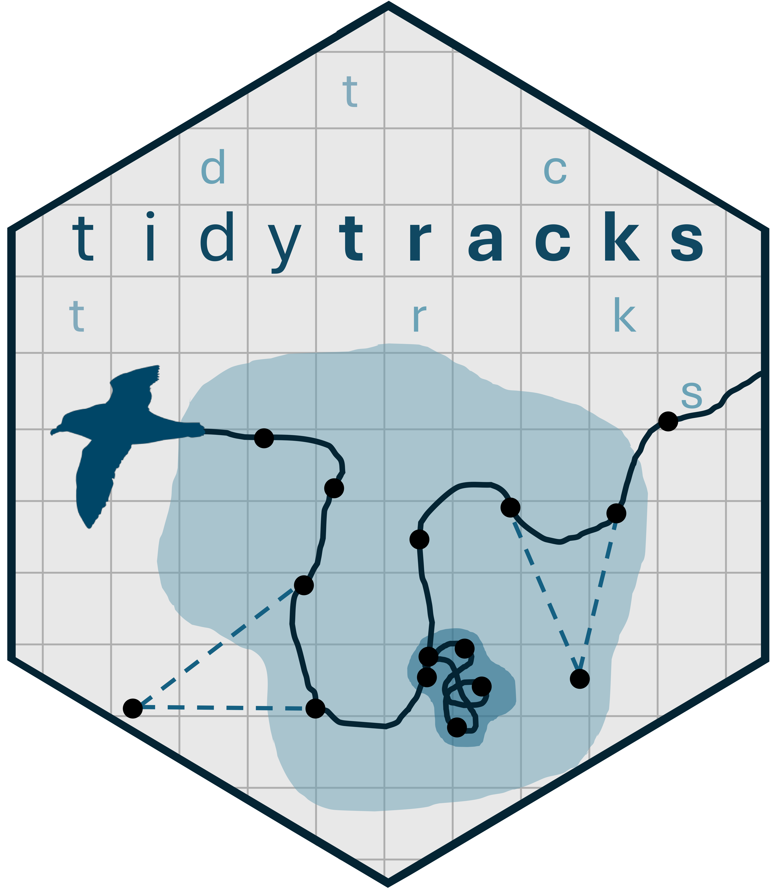

# tidytracks 

`tidytracks` is a tidyverse-friendly R package for processing, analysing
and visualising animal tracking data.

Movement ecology has been transformed by the availability of
high-resolution tracking data, creating demand for tools that enable
fast and reproducible data analysis.

Built on the modern [`sf`](https://r-spatial.github.io/sf/) spatial
infrastructure and leveraging the
[`move2`](https://bartk.gitlab.io/move2/) object class, `tidytracks`
organises data into efficient, relational tables that link
spatiotemporal tracks with animal- and deployment-level metadata. Its
consistent grammar of functions condenses complex workflows into a few
lines of clear, intuitive code.

`tidytracks` includes fast implementations of essential analysis steps -
including speed filtering, trip splitting, summary statistics, and home
range estimation - that previously required data class conversions
across multiple packages. Integration with
[`ggplot2`](https://ggplot2.tidyverse.org/) enables easy plotting of
maps and figures.

By simplifying and standardising common tasks in movement analysis,
`tidytracks` accelerates exploratory workflows and promotes
reproducibility in movement ecology.

## Installation

You can install the development version of tidytracks from
[GitHub](https://github.com/) with:

``` r

# install.packages("pak")
pak::pak("EvolEcolGroup/tidytracks")
```
